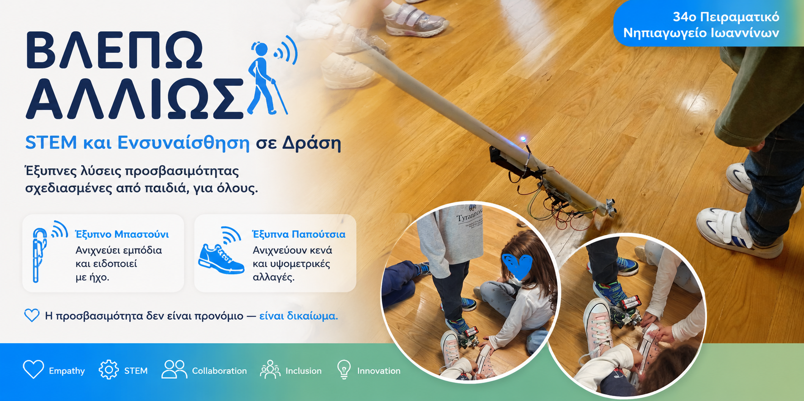
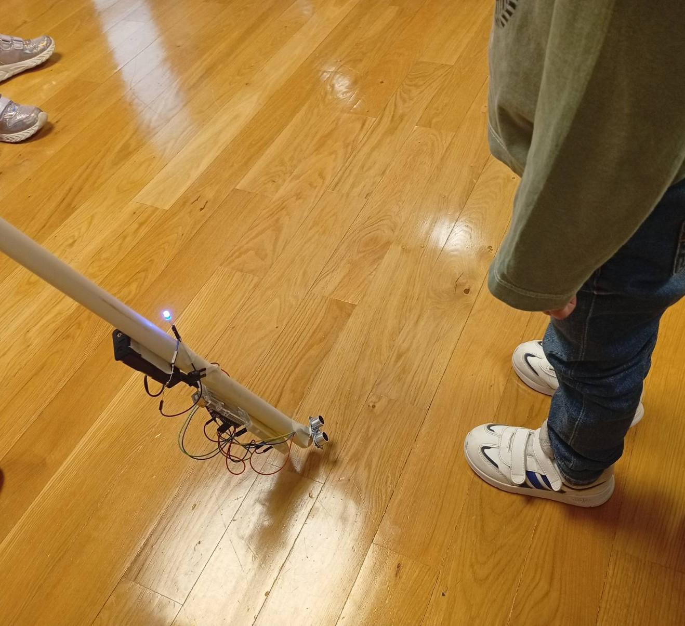
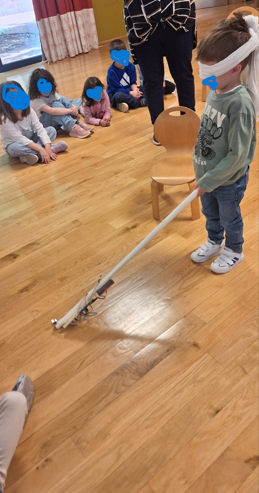
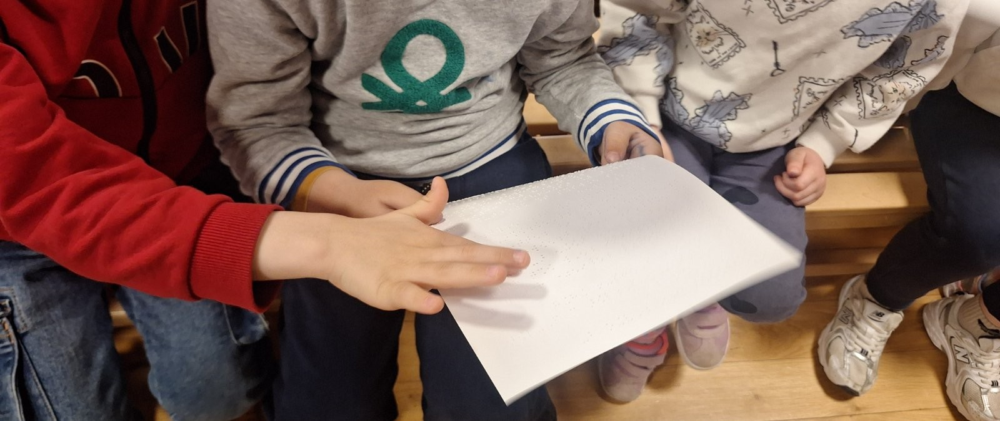
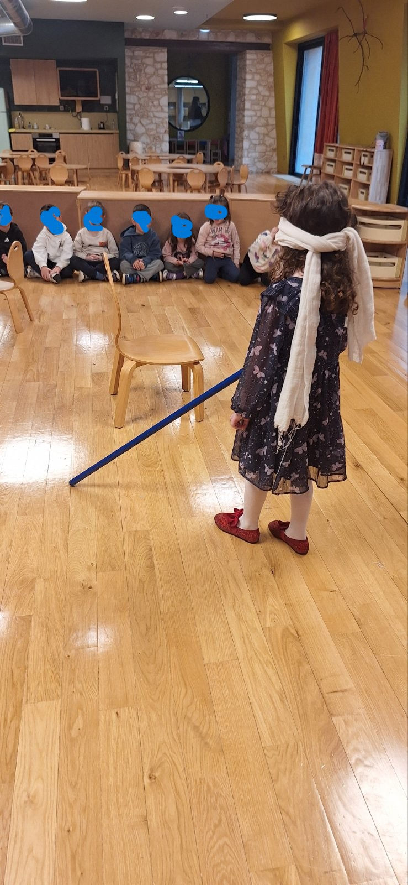
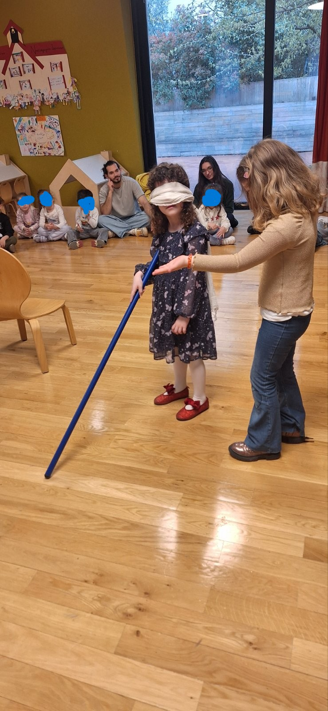
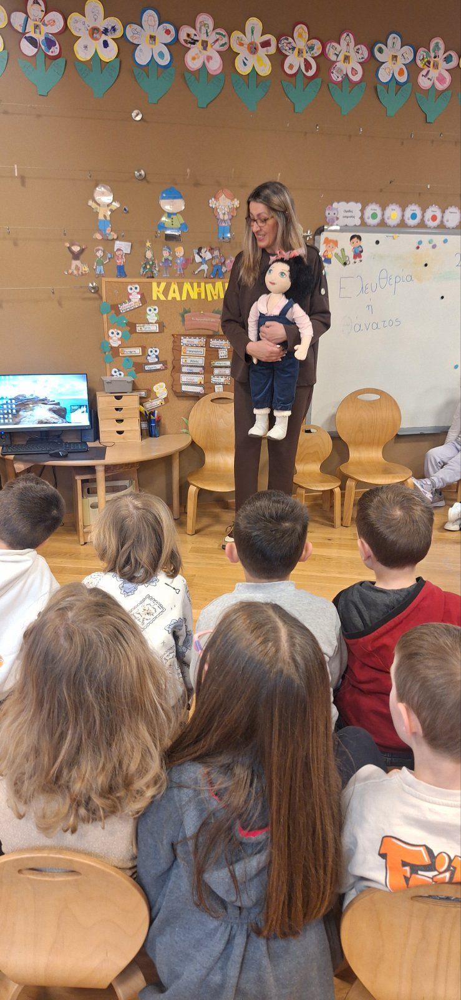
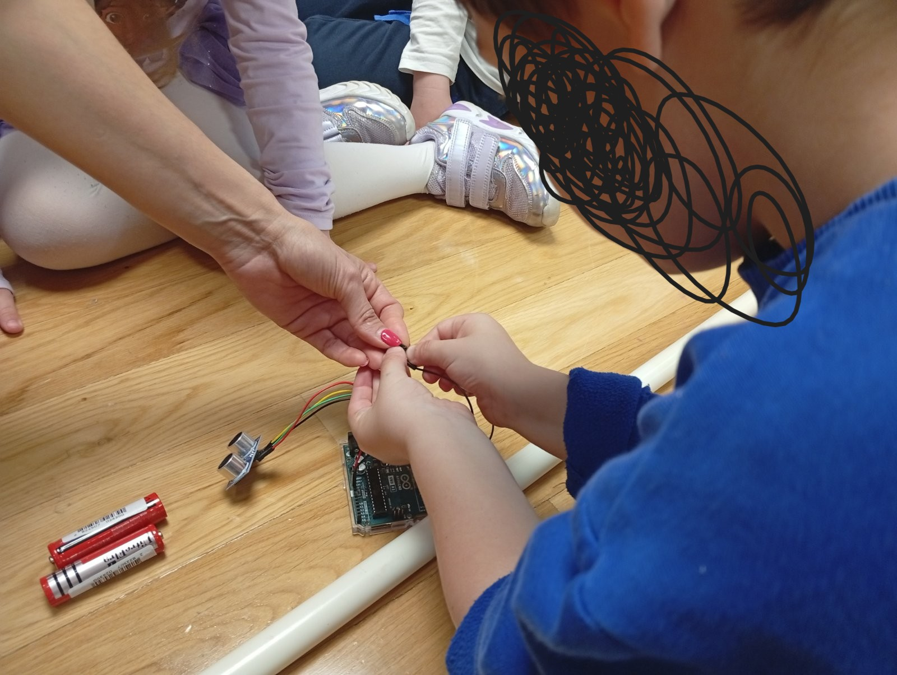
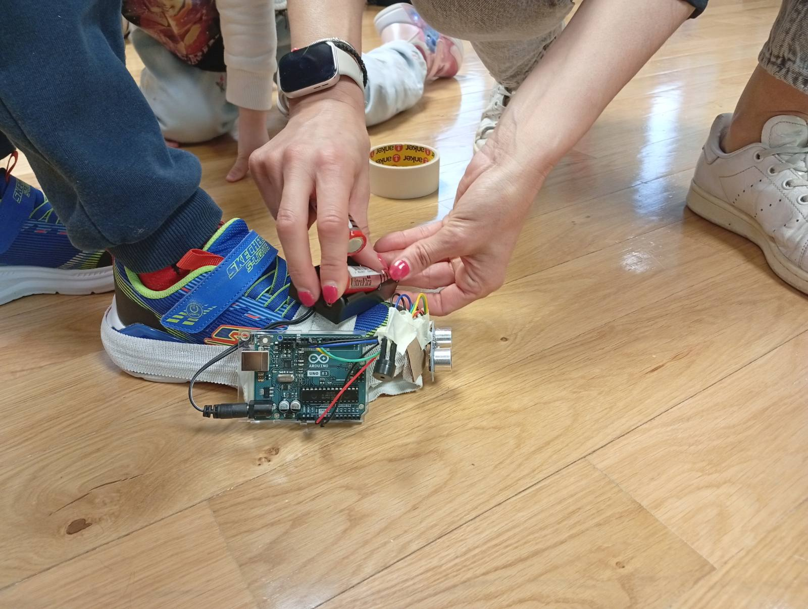
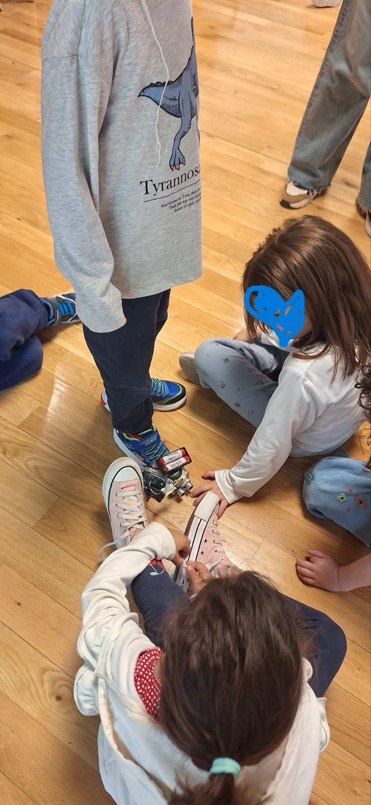

<p align="center">
  
</p>


<div align="center">

# 👁️ ΒΛΕΠΩ ΑΛΛΙΩΣ

### Inclusive STEM Project for Visual Accessibility  
### 34ο Πειραματικό Νηπιαγωγείο Ιωαννίνων

---

[]()
[]()
[]()
[]()

---

### 🦯 Smart Cane + 👟 Smart Shoes  
### Assistive Technology Designed Through Kindergarten STEM Learning

---

🇬🇷 Ελληνικά • 🇬🇧 English • 🌍 Accessibility • 🤝 Inclusion • 🚀 Innovation

</div>

---

---

## 🌍 About The Project

Το «Βλέπω Αλλιώς» είναι ένα συνεργατικό STEM project προσχολικής εκπαίδευσης που σχεδιάστηκε από δύο τμήματα νηπιαγωγείου με στόχο την κατανόηση των δυσκολιών που αντιμετωπίζουν τα άτομα με προβλήματα όρασης και τη δημιουργία υποστηρικτικών τεχνολογικών λύσεων.

Το έργο συνδυάζει:
- κοινωνική ευαισθητοποίηση,
- συμπερίληψη,
- τεχνολογία,
- μηχανική,
- βιωματική μάθηση,
- και συνεργατική επίλυση προβλημάτων.

---
## 📸 Project Gallery

<div align="center">

| Smart Cane Prototype | Smart Shoes Prototype |
|---|---|
|  |  |

</div>

---

<div align="center">

| Classroom Activities | Empathy Learning |
|---|---|
|  |  |

</div>

---
---

# 🇬🇷 Ελληνική Περίληψη

Το «Βλέπω Αλλιώς» είναι ένα συνεργατικό STEM έργο προσχολικής εκπαίδευσης που σχεδιάστηκε από δύο τμήματα νηπιαγωγείου με στόχο την κατανόηση των δυσκολιών που αντιμετωπίζουν τα άτομα με προβλήματα όρασης και τη δημιουργία υποστηρικτικών τεχνολογικών λύσεων.

Το έργο περιλαμβάνει:
- ένα έξυπνο μπαστούνι ανίχνευσης εμποδίων,
- ένα σύστημα έξυπνων παπουτσιών για ανίχνευση κενών και υψομετρικών αλλαγών,
- δραστηριότητες ενσυναίσθησης,
- βιωματική και συνεργατική μάθηση.

Μέσα από τη διαδικασία αυτή, τα παιδιά καλλιεργούν δεξιότητες STEM, δημιουργικότητα, συνεργασία και κοινωνική υπευθυνότητα.

---

# 🇬🇧 English Abstract

“Seeing Differently” is a collaborative early childhood STEM project developed by two kindergarten classrooms aiming to explore the challenges faced by visually impaired individuals and design supportive technological solutions.

The project includes:
- a smart obstacle-detection cane,
- smart shoes capable of detecting gaps and ground-level changes,
- empathy-based classroom activities,
- hands-on collaborative learning experiences.

Through this process, children develop STEM skills, creativity, teamwork, empathy, and social responsibility while understanding how technology can improve accessibility and inclusion.

---

# 🦯 Smart Cane System

Το έξυπνο μπαστούνι χρησιμοποιεί αισθητήρα υπερήχων για την ανίχνευση εμποδίων και προειδοποιεί τον χρήστη μέσω ηχητικού σήματος.

```
Obstacle → Ultrasonic Sensor → Arduino → Buzzer
```

---

# 👟 Smart Shoes System

Τα έξυπνα παπούτσια ανιχνεύουν υψομετρικές αλλαγές και κενά στο έδαφος και ειδοποιούν μέσω ηχητικού σήματος.

```
Ground Gap → Sensor → Arduino → buzzer
```

---

### Το σύστημα περιλαμβάνει:
- 🦯 Έξυπνο μπαστούνι με αισθητήρα απόστασης και ηχητική ειδοποίηση  
- 👟 Έξυπνα παπούτσια με ανίχνευση υψομετρικών αλλαγών και δόνηση  

---

# 📚 Learning Journey

## 1️⃣ Understanding the Problem

Τα παιδιά συμμετείχαν σε βιωματικές δραστηριότητες προσομοίωσης ώστε να κατανοήσουν τις δυσκολίες που αντιμετωπίζουν τα άτομα με προβλήματα όρασης στην καθημερινή μετακίνηση.



---

## 2️⃣ Brainstorming Solutions

Μέσα από συζήτηση, συνεργασία και διερεύνηση ιδεών, τα παιδιά πρότειναν τρόπους με τους οποίους η τεχνολογία μπορεί να βοηθήσει στην ασφαλή μετακίνηση.



---

## 3️⃣ Building the Prototypes

Οι μαθητές συμμετείχαν ενεργά στην κατασκευή, στη συνδεσμολογία και στη δοκιμή των συστημάτων χρησιμοποιώντας αισθητήρες, Arduino και απλά υλικά κατασκευής.


---

## 4️⃣ Testing & Improving

Τα παιδιά δοκίμασαν επανειλημμένα τις κατασκευές, παρατήρησαν τη λειτουργία τους και πρότειναν βελτιώσεις μέσα από διαδικασίες πειραματισμού και αναστοχασμού.


---

## 5️⃣ Final Inclusive System

Το τελικό σύστημα συνδυάζει:
- έξυπνο μπαστούνι ανίχνευσης εμποδίων,
- έξυπνα παπούτσια ανίχνευσης κενού και υψομετρικών αλλαγών,
- ηχητική και απτική ανατροφοδότηση.

Το έργο αναδεικνύει πώς η τεχνολογία μπορεί να λειτουργήσει ως εργαλείο κοινωνικής συμπερίληψης και ενσυναίσθησης ήδη από την προσχολική ηλικία.

---

# 🔧 Technical Architecture

Το έργο αποτελείται από δύο συνεργαζόμενα υποσυστήματα:

| Subsystem | Function |
|---|---|
| 🦯 Smart Cane | Ανίχνευση εμποδίων σε ύψος σώματος |
| 👟 Smart Shoes | Ανίχνευση κενών και υψομετρικών αλλαγών |

---

## 🧩 System Architecture

<div align="center">

```text
SMART CANE

Obstacle Detection
        ↓
HC-SR04 Ultrasonic Sensor
        ↓
Arduino UNO
        ↓
Buzzer Alert
```

---

```text
SMART SHOES

Ground Gap Detection
        ↓
HC-SR04 Ultrasonic Sensor
        ↓
Arduino UNO
        ↓
Audio Alert
```

</div>

---

## 🔌 Hardware Overview

| Component | Purpose |
|---|---|
| Arduino UNO | Main microcontroller |
| HC-SR04 Sensor | Distance detection |
| Passive Buzzer | Audio warning |
| Battery Pack | Portable power |
| Jumper Wires | Connections |
| Wearable Materials | Prototype construction |

---

# 🧩 Repository Structure

```text
blepw_alliws/
│
├── smart-cane/
│   ├── code/
│   ├── materials/
│   ├── wiring/
│   ├── build/
│   └── testing/
│
├── smart-shoes/
│   ├── code/
│   ├── materials/
│   ├── wiring/
│   ├── build/
│   └── testing/
│
├── media/
│   ├── photos/
│   ├── videos/
│   ├── posters/
│   └── presentations/
│
├── classroom-activities/
├── docs/
└── assets/
```

---

# ⚙️ Technologies Used

- Arduino UNO
- HC-SR04 Ultrasonic Sensors
- Passive Buzzer
- Vibration Motor
- Jumper Wires
- Battery Modules
- STEM Methodology
- Inquiry-Based Learning
- Collaborative Learning

---

## 🔌 Hardware Overview

| Component | Purpose |
|---|---|
| Arduino UNO | Main microcontroller |
| HC-SR04 Sensor | Distance detection |
| Passive Buzzer | Audio warning |
| Battery Pack | Portable power |
| Jumper Wires | Connections |
| Wearable Materials | Prototype construction |

---

# 🧠 Educational Approach

Το έργο βασίζεται σε:
- βιωματική μάθηση,
- διερευνητική προσέγγιση,
- STEM εκπαίδευση,
- συνεργατική επίλυση προβλημάτων,
- και καλλιέργεια ενσυναίσθησης.

Οι κατασκευές λειτουργούν ως εργαλεία διερεύνησης και κοινωνικής ευαισθητοποίησης και όχι ως αυτοσκοπός.

---

## 🎯 Στόχοι

- Καλλιέργεια ενσυναίσθησης και σεβασμού στη διαφορετικότητα  
- Εισαγωγή σε βασικές έννοιες STEM (αισθητήρες, είσοδος/έξοδος, δεδομένα)  
- Ανάπτυξη συνεργασίας και ομαδικής επίλυσης προβλημάτων  
- Επαφή με την έννοια της προσβασιμότητας  
- Δημιουργική διερεύνηση πραγματικών κοινωνικών προβλημάτων  

---

## 🧠 STEM & Δεξιότητες 21ου Αιώνα

Το έργο ενισχύει:

- Κριτική σκέψη  
- Δημιουργικότητα  
- Συνεργασία  
- Επικοινωνία  
- Υπολογιστική σκέψη  
- Συναισθηματική νοημοσύνη  
- Κοινωνική υπευθυνότητα  

---

## 🧰 Υλικά

| Υλικό | Ποσότητα |
|------|----------|
| Arduino UNO R3 | 2 |
| HC-SR04 Ultrasonic Sensor | 2 |
| Passive Buzzer | 2 |
| Jumper Wires | 1 set |
| Battery Holder | 2 |
| Switch | 1 |

💰 Συνολικό κόστος: ~90€

---

## 🌱 Κοινωνικός Αντίκτυπος

Η προσβασιμότητα δεν είναι προνόμιο — είναι δικαίωμα.

Μέσα από το έργο, τα παιδιά συνειδητοποιούν ότι η τεχνολογία μπορεί να χρησιμοποιηθεί για να βελτιώσει τη ζωή των ανθρώπων και να δημιουργήσει μια πιο συμπεριληπτική κοινωνία.

---
## 📊 Project Impact

<div align="center">

| Category | Impact |
|---|---|
| 👧 Students Involved | 2 Kindergarten Classrooms |
| 🤝 Collaboration | Team-based learning |
| 🧠 STEM Skills | Sensors, coding, engineering |
| ❤️ Social Skills | Empathy & inclusion |
| 🌍 SDGs Supported | 4, 9, 10 |
| 🦯 Accessibility Focus | Visual impairment support |
| 🔧 Prototypes Developed | Smart Cane & Smart Shoes |
| 📚 Educational Approach | Inquiry-based STEM learning |

</div>

---

# 🌍 Sustainable Development Goals (SDGs)

Το έργο «Βλέπω Αλλιώς» συνδέεται με τους Στόχους Βιώσιμης Ανάπτυξης των Ηνωμένων Εθνών:

| SDG | Description |
|---|---|
| 🎓 SDG 4 | Ποιοτική Εκπαίδευση |
| ⚖️ SDG 10 | Λιγότερες Ανισότητες |
| 🏙️ SDG 11 | Βιώσιμες και Προσβάσιμες Πόλεις |
| 🤝 SDG 17 | Συνεργασία για τους Στόχους |

Το project προσεγγίζει την τεχνολογία ως εργαλείο κοινωνικής συμπερίληψης, ενσυναίσθησης και ενεργού πολιτειότητας.

---

## 🏫 Εκπαιδευτική Προσέγγιση

Το έργο βασίζεται σε:
- Βιωματική μάθηση  
- Διερευνητική προσέγγιση  
- Συνεργατική εργασία  
- STEM εκπαίδευση  
- Μάθηση μέσω πραγματικών προβλημάτων  

---

## 🔓 Ανοιχτό Εκπαιδευτικό Υλικό

Το project διατίθεται ως ανοικτό εκπαιδευτικό έργο ώστε να μπορεί να αξιοποιηθεί και να προσαρμοστεί από άλλα σχολεία και εκπαιδευτικούς.

---

# 🤝 Contributing & Educational Use

Το έργο διατίθεται ως ανοικτό εκπαιδευτικό project και μπορεί να αξιοποιηθεί από:

- σχολεία,
- νηπιαγωγεία,
- STEM εργαστήρια,
- εκπαιδευτικούς,
- ομάδες εκπαιδευτικής ρομποτικής.

Οι κατασκευές, οι δραστηριότητες και το εκπαιδευτικό υλικό μπορούν να προσαρμοστούν ανάλογα με τις ανάγκες κάθε μαθησιακού περιβάλλοντος.

---

# 💡 Possible Future Extensions

Το project μπορεί να επεκταθεί με:
- vibration motors αντί buzzer,
- wearable accessibility systems,
- AI obstacle recognition,
- smart vests,
- accessibility mapping,
- συνεργασίες με φορείς αναπηρίας,
- διασχολικά STEM δίκτυα.

---

# 📸 Project Gallery

## 🦯 Smart Cane Development

<p align="center">
  
  
</p>

<p align="center">
  
  
</p>

---

## 👟 Smart Shoes Development

<p align="center">
  
  
</p>

---

## 🧠 Classroom Activities & Empathy

<p align="center">
  
  
</p>

<p align="center">
  
  
</p>

---
## 👥 Ομάδα

34ο Πειραματικό Νηπιαγωγείο Ιωαννίνων

---

## 📄 Άδεια Χρήσης

MIT License

---

## 🚀 Τελικό Μήνυμα

Το «Βλέπω Αλλιώς» δείχνει ότι ακόμα και στην προσχολική ηλικία, τα παιδιά μπορούν να σχεδιάσουν λύσεις για πραγματικά κοινωνικά προβλήματα, συνδυάζοντας τεχνολογία, συνεργασία και ενσυναίσθηση.
